# presidential-sentiment-2020
A sentiment analysis project on presidential candidate speeches during the 2020 election.
*Originally a final project for DSC 161 at the University of California, San Diego*

## Abstract

This study examines the impact of the COVID-19 pandemic on the rhetoric of U.S. presidential candidates Donald Trump and Joe Biden during the 2020 election cycle, utilizing a corpus of over 700 publicly broadcasted campaign speeches from January 2019 to January 2021. Moving beyond traditional social media analyses, this research leverages a novel dataset of broadcast speeches to explore shifts in thematic focus and sentiment related to COVID-19. The analysis comprises three foundational components: a net sentiment analysis, Latent Dirichlet Allocation (LDA) for topic modeling, and a prevalence analysis of COVID-19-related content. A qualitative categorization of speech snippets referencing COVID-19 was developed to further highlight the prevalence of the topic and was used to train a logistic regression classifier. The model achieved approximately 74% accuracy when predicting on COVID-related snippets, with results indicating statistically significant change in sentiment before versus after the pandemic became central to public discourse. These findings suggest that, within televised speeches, presidential rhetoric shifted to be more relatable to the issues the public faced concerning COVID-19, contrasting with the more negative sentiment observed in social media platforms. Overall, this research demonstrates the utility of broadcast speech analysis and text modeling techniques in understanding political communication dynamics during unprecedented crises.

## Introduction

The COVID-19 pandemic has profoundly reshaped societal perspectives on how to engage in public discourse during times of health outbreaks. Stay-at-home orders, masking, and social distancing required politicians to rethink their campaign strategies across various platforms. While numerous studies have analyzed social media content to gauge shifts in political sentiment and messaging, less attention has been given to formal, broadcasted speeches delivered by presidential candidates, which often serve as a primary source of official communication and policy positioning when public forums are unavailable. This project investigates how the rhetoric of Donald Trump and Joe Biden evolved during the 2020 U.S. presidential election, with a particular focus on the impact of COVID-19. By analyzing over 700 publicly available campaign speeches spanning January 2019 to January 2021, this porject aims to determine whether and how candidates' messaging regarding the pandemic changed as it transitioned from a distant health crisis to a central political, social, and economic issue. This study seeks to uncover shifts in thematic focus and emotional tone to understand political communication dynamics during crises and highlights differences in rhetoric across political candidates.

For this project, I have used a text dataset of campaign speeches of the main tickets in the 2020 US presidential election . These speeches are from public speeches delivered by Republican candidate Donald Trump and Democratic candidate Joe Biden via public broadcasting sources such as C-SPAN. Over 700 speeches were recorded, some of which are duplicate broadcasts by different channels. While some speeches are short briefings, many speeches span for minutes, causing large size discrepancies between speeches. To normalize length, speeches are broken down into chunks of 250 words. The implications of this change are that entire speeches will no longer be classified as being related to COVID if only a subsection mentions keywords related to the topic. Our sentiment analysis will show graphs based on full speeches as a reference to the graph based on the subsections. The time period covers speeches between January 2019 through January 2021. Many of our tests will compare text by each president before and after February 11, 2020, the day the World Health Organization (WHO) declared the official disease name "COVID-19".

Background reading reveals that many studies have been performed in 2021 solely on Twitter data on presidential posts. This data is numerous and scraping using the Twitter API was simpler. Nowadays, X prevents standard users from using its API to scrape posts in an effort to combat bot activity as well as to protect a potential monetizable data source. The data source I am using is relatively new, having been created one year ago. Xia et al. analyzes over 260,000 Twitter posts related to the 2020 U.S. presidential election using multi-layer perceptrons, finding that negative sentiment was more prevalent than positive, and demonstrates that social media sentiment trends can reveal key political events and opinions (2021). Ali et al. analyze 7.6 million tweets related to the 2020 US presidential election to reveal how deleted, suspended, and accessible tweets differ in public sentiment towards candidates, emphasizing the importance of including inaccessible posts for accurate opinion assessment (2022).

## Question

What impact did COVID-19 have on the rhetoric of presidential candidates? Do we see a change in speeches before the event became mainstream news? COVID-19 and Statewide Shutdowns led to a major shift in the political climate. Sixty-two percent of sampled voters said the coronavirus outbreak was a top issue in the 2020 election. We will attempt to determine if presidential candidates shifted their campaign platform based on this issue.

## Hypothesis

To analyze the impact of COVID-19 on the rhetoric of presidential candidates, I will develop a categorization based on the thematic focus of their speeches concerning COVID-19. Each speech snippet that mentions related topics such as COVID-19, the pandemic, or vaccines will be coded into this category. This approach allows for a nuanced understanding of how candidates’ messaging shifted before and after COVID-19 became a prominent issue in public broadcasting, providing insight into whether their rhetoric became more empathetic, accusatory, optimistic, or pessimistic over time. As such, our hypothesis is written below:

> $H_0$: The probability of a speech being related to COVID-19 does not depend on whether the speech was delivered before or after February 11, 2020.
> 
> $H_1$: The probability of a speech being related to COVID-19 increases if it was delivered after February 11, 2020.

To test this hypothesis, we will implement Pearson's Chi-squared test with Yates' continuity correction since we are working with qualitative data.

## Exploratory Data Analysis

Before this analysis can be made, we must first perform three prior analyses: A net sentiment analysis of speeches by president, a Latent Dirichlet allocation and sentiment analysis grouped by speech topic, and a topic prevalence analysis of COVID-19 in speeches. These analyses will corroborate our findings that show there are some shifts in presidential speech platforms and will be the foundation of our logistic regression model weights in this project and any future improvements. This categorization will serve as a qualitative measure to capture the shifts in rhetoric, enabling comparison across different time periods and candidates. By examining the prevalence of each tone before and during COVID-19, I can assess whether candidates adapted their messaging to reflect the evolving political and social climate. As this was an individual project, inter-coder reliability and conflict was a non-issue, as all code was streamlined and validated to work before moving onto the next analysis.

### Sentiment Analysis

Sentiment analysis is a technique used in natural language processing (NLP) to determine the emotional tone or attitude expressed within textual data. It involves computationally identifying and classifying opinions, sentiments, or emotions conveyed in wordsin a documents, typically as positive, negative, or neutral. In political discourse, sentiment analysis can reveal shifts in tone, public opinion, or strategic messaging. By quantifying these emotional cues, researchers can assess how politicians' rhetoric evolves over time, especially in response to major events, providing insights into their communication strategies and public engagement.

The goal of this section is to analyze the sentiment scores of presidential candidates Joe Biden and Donald Trump over their speech history. This is a primary indicator of overall sentiment over time before and after the mainstream discussion of COVID-19. By analysing the regression lines of each candidate, significant change in sentiment can be discovered by comparing the shift over the y-axis at our chosen time point. The script loads and preprocesses speech data, splits lengthy speeches into manageable chunks, and constructs text corpora for each candidate. It then performs sentiment analysis by calculating a net sentiment score based on positive and negative word counts within each speech segment. The resulting sentiment scores are visualized over time with plots highlighting the period before and after the COVID-19 outbreak became prominent, enabling an examination of potential shifts in tone or emphasis related to COVID-19 in their public communications.

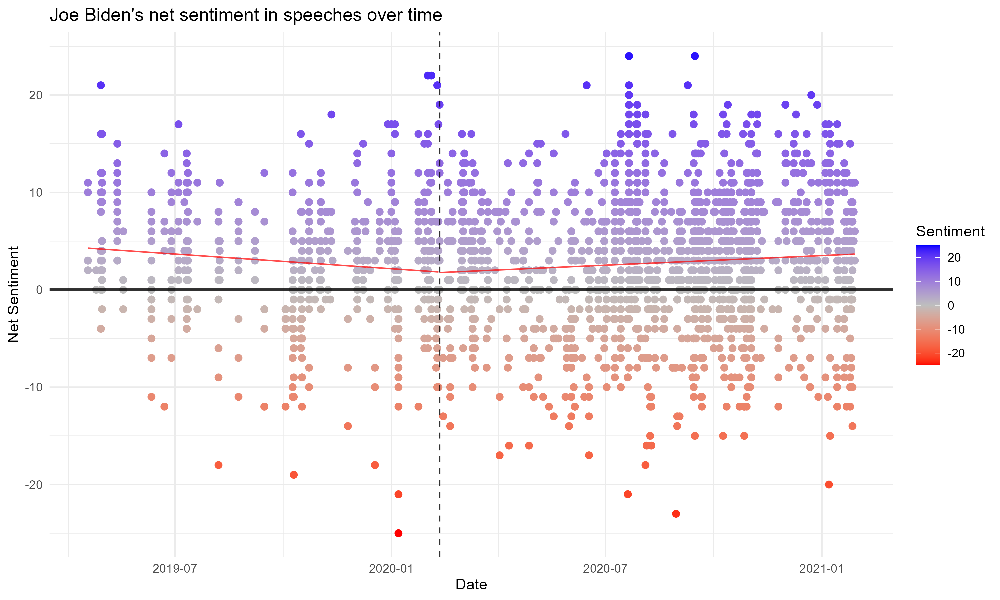

<small><i>Figure 1: Joe Biden's speech sentiment values over time</i></small>

 

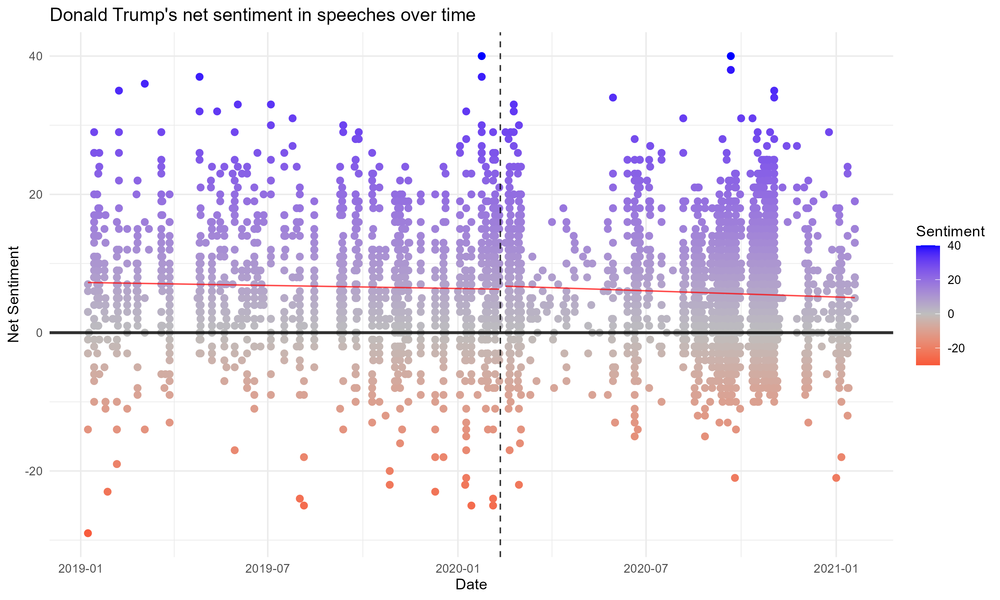

<small><i>Figure 2: Donald Trump's speech sentiment values over time</i></small>

 

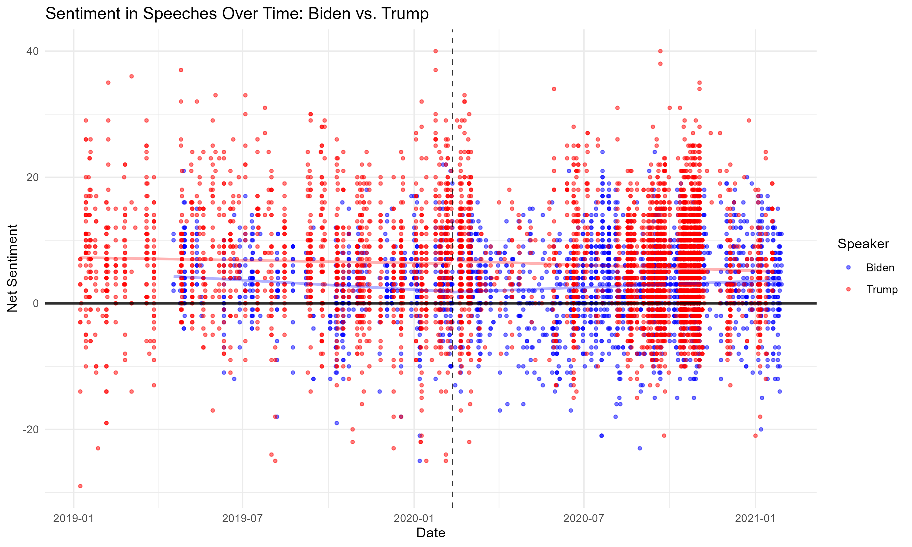

<small><i>Figure 3: Combined sentiment values over time</i></small>

 

Each dot in the scatterplot represents a segment of a speech. The x-axis represents the date in which the speech was televised, and the y-axis represents the sentiment score of that speech fragment. Two regression lines are calculated with their split along February 11, 2020. Additionally, sentiment scores are color coded to highlight which particular sections were more extreme in positivity or negativity. Both presidential candidate's graphs are then superimposed to normalize the scale of the y-axis. Our original project performed sentiment analysis on the entire corpus as a whole. Results are shown below to provide an alternate view of total sentiment across a speech.

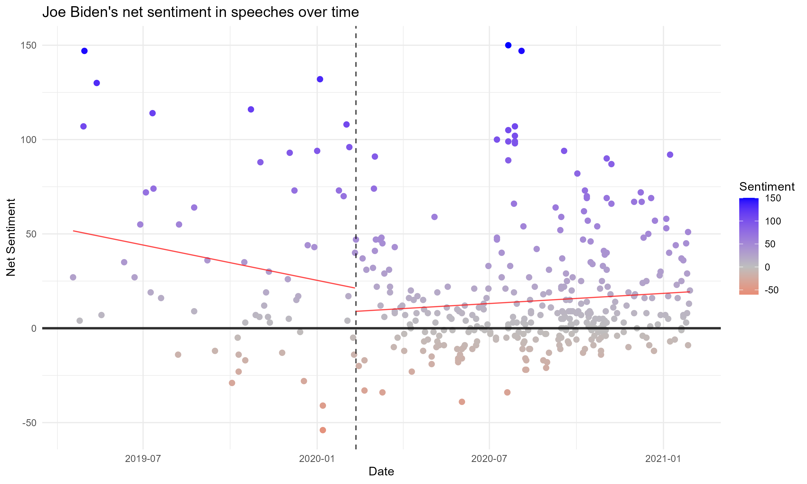

<small><i>Figure 4: Joe Biden's sentiment values of full corpora over time</i></small>

 

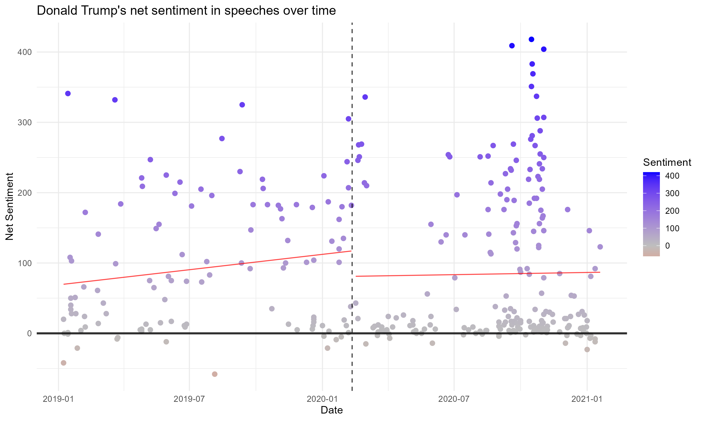

<small><i>Figure 5: Donald Trump's sentiment values of full corpora over time</i></small>

 

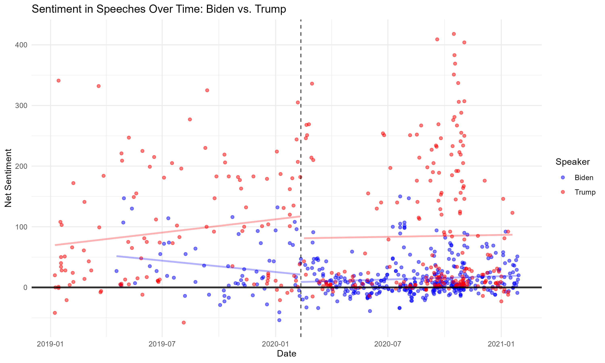

<small><i>Figure 6: Combined sentiment values of full corpora over time</i></small>

 

The graphs above allow us to infer a few interesting observations about the text:
When speeches are split into sections, the regression lines lose their significance, as many sections are neutral in sentiment. Calculating sentiment of whole documents provides a better understanding of the general tone of the speech. Regression lines see a significant jump down after February 11, 2020, signaling that topics were generally less positive in response to the societal changes brought about by the pandemic. A positive slope for the second regression line for both candidates signifies that sentiment gradually increased as breakthroughs were being made to combat the virus.

Additionally, we can identify from Figure 6 that Donald Trump's highest sentiment scores are overwhelmingly higher than Joe Biden's most positive speech. Why would this be? In order to answer this question, we must perform LDA to identify the primary topic of each speech.

### Latent Dirichlet Allocation

Latent Dirichlet Allocation (LDA) is a statistical modeling technique used in natural language processing to discover underlying topics within large collections of text data. Speeches consist of general campaigning strategies to more specific topics such as healthcare, global policy, the economy, immigration, labor, and the COVID-19 outbreak. It operates on the assumption that each document is a mixture of multiple topics, and each topic is characterized by a distribution of words. By analyzing the co-occurrence patterns of words across documents, LDA infers these latent topics, allowing researchers to interpret the themes present in the text corpus. The model outputs probability distributions for each document over topics and for each topic over words, enabling a nuanced understanding of the thematic structure within the data.

The goal of this section is to analyze changes in political discussion by each candidate through their speeches. We appliy LDA to identify 30 underlying topics in their speeches over time. The reason 30 topics was chosen was because it landed in a sweet spot between topic broadness, topic speficity, and code complexity. A lower number resulted in topics that were too broad, such as all healthcare topics being recognized as COVID-related. Likewise, a higher number resulted in topics that were too specific to be significant, such as Campaigning in Illinois versus Campaigning in Pennsylvania, and resulted in too much clutter when graphed. Our project then assigns each speech segment to the most relevant topic and visualizes how the candidates' focus shifted, especially toward COVID-related topics, by examining sentiment trends within these topics before and after the pandemic's rise. This analysis aims to determine whether and how the candidates' campaign messaging shifted to emphasize COVID-19 in response to its increasing importance in public and political discourse.

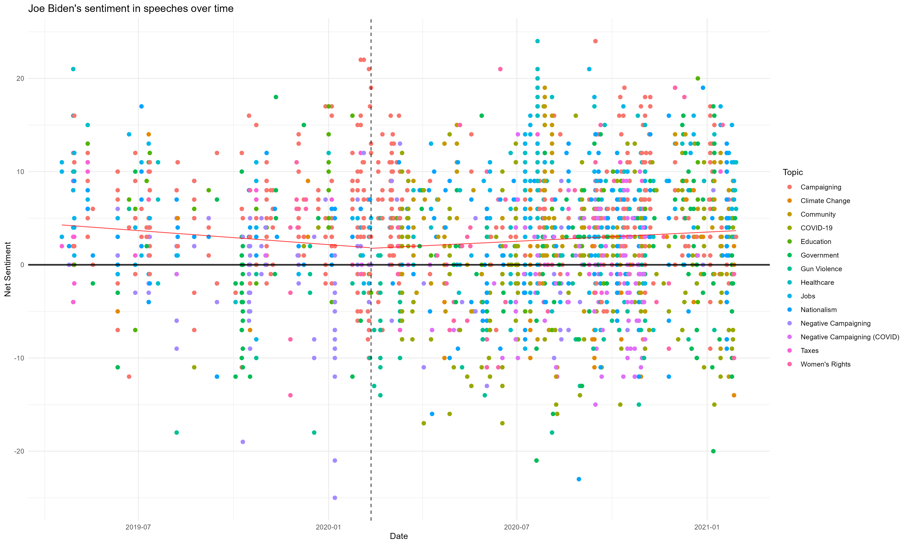

<small><i>Figure 7: Joe Biden's Speeches categorized by topic</i></small>

 

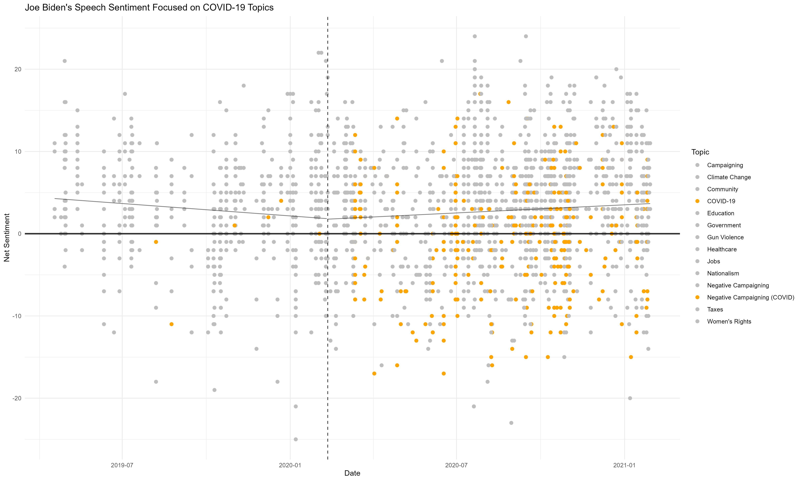

<small><i>Figure 8: Joe Biden's Speeches related to COVID have been highlighted</i></small>

 

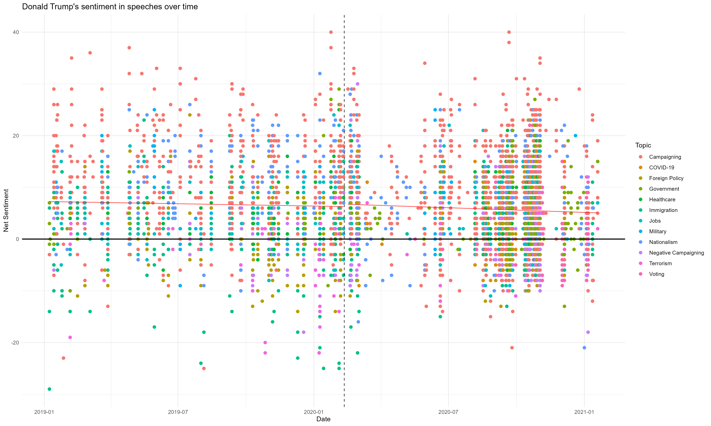

<small><i>Figure 9: Donald Trump's Speeches categorized by topic</i></small>

 

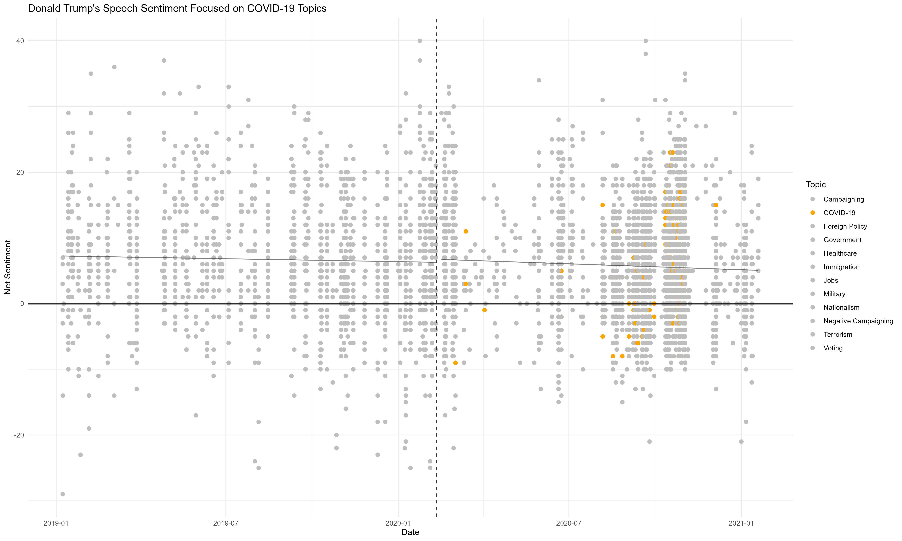

<small><i>Figure 10: Donald Trump's Speeches related to COVID have been highlighted</i></small>

 

Topics directly related to COVID-19 are highlighted in their own graphs, showcasing how often the topic was brought up by each candidate. We notice a few interesting observations in these graphs. First, there are a few speeches in Joe Biden's cluster graph that are identified as being COVID-related, despite 

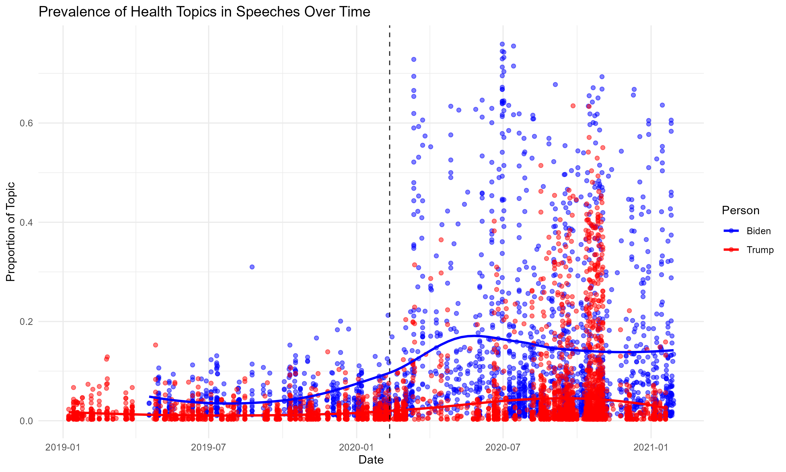

<small><i>Figure 11: Topic Prevalence of COVID over time</i></small>

 